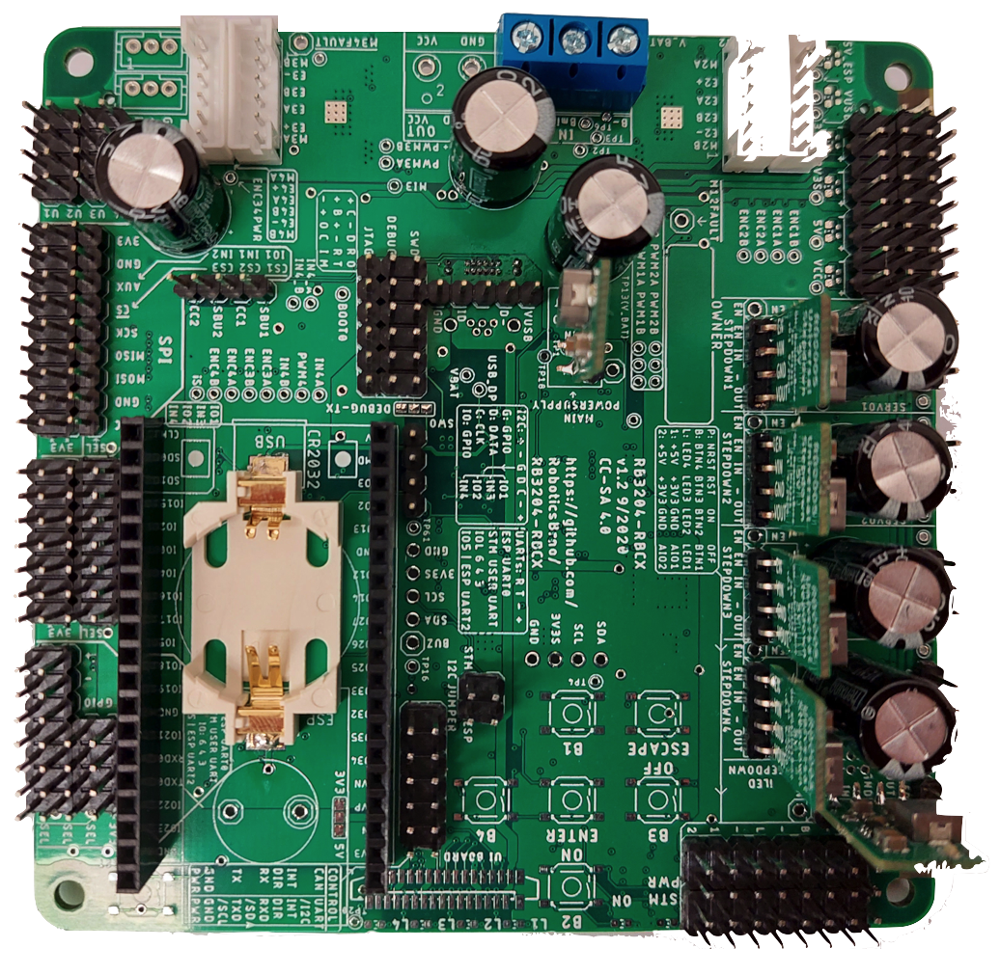
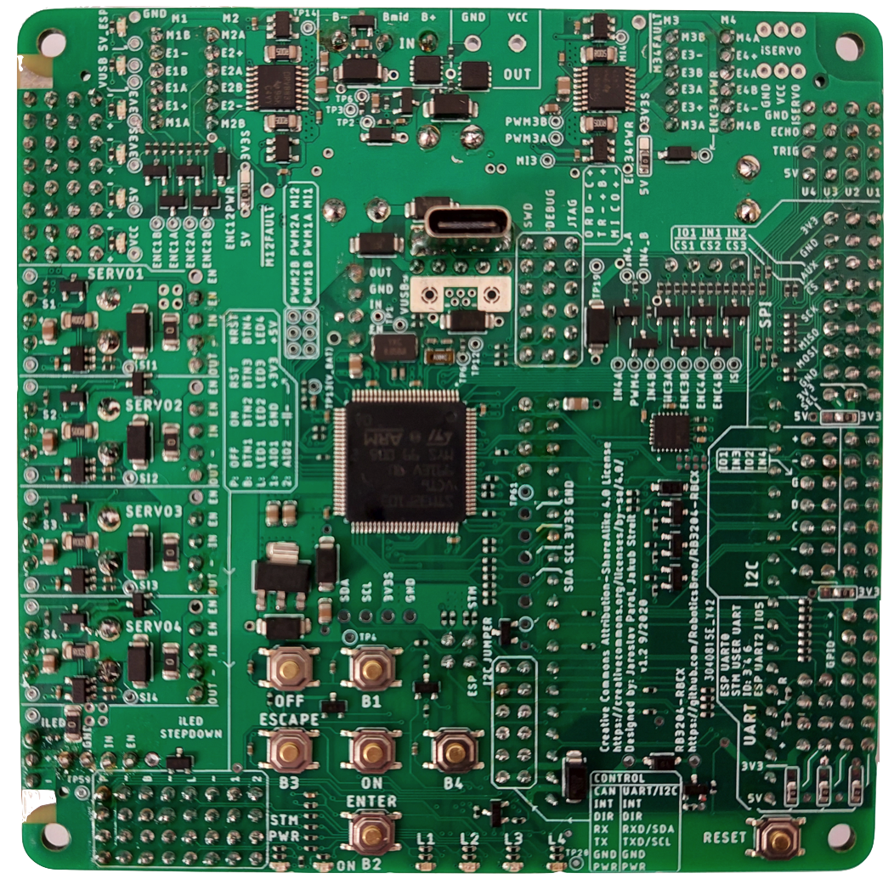
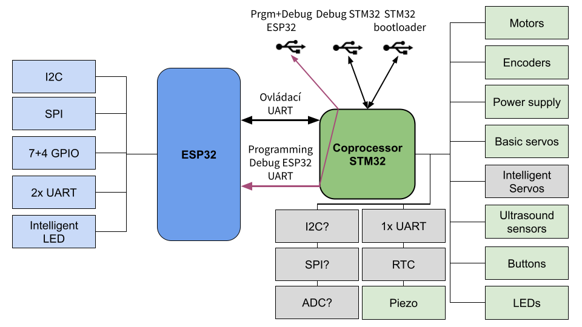
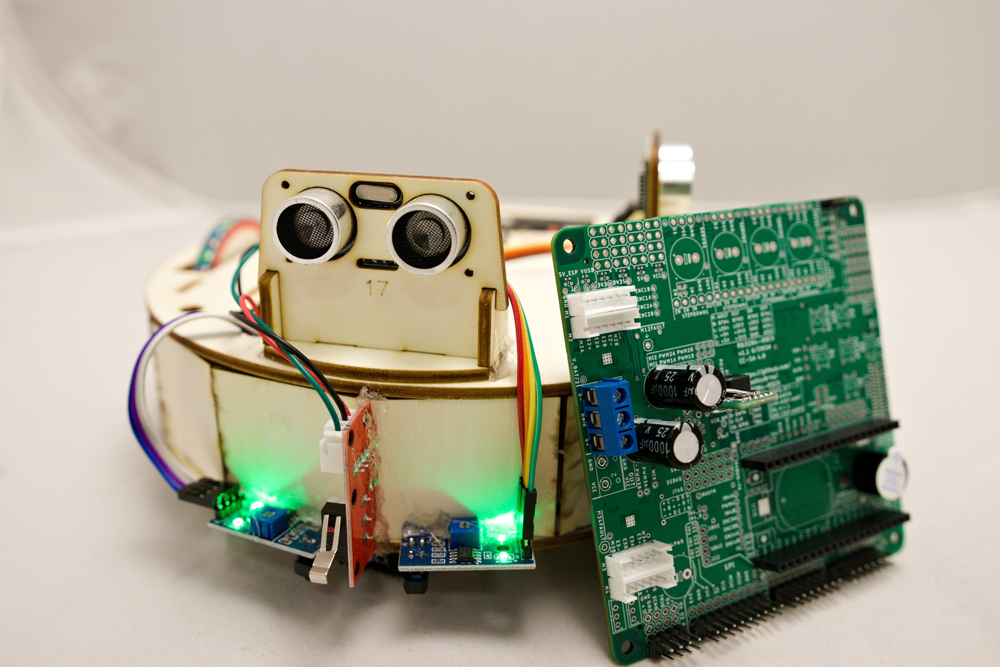

# RB3204-RBCX

RBCX is a universal controller for hobby robots. It is a successor of [RB3201-RBControl](https://github.com/RoboticsBrno/RB3201-RBControl).
It is used in our robot [Robotka](https://robotka.robotickytabor.cz) on [Robo camp 2020](https://robotickytabor.cz).

  	<td></td>
	<td></td>

## Features
- 4 DC motors with encoders
- 4 servos with feedback (via ADC)
- 4 LEDs
- buttons with the gamepad interface
- Smart Servo connector
- piezo buzzer
- RTC
- ultra-sonic distance sensor connector
- I2C connectors
- OLED display connector
- accelerometer and gyroscope
- micro USB and USB-C connectors
- battery connector (without charging circuit)

## Hardware
Board is based on `STM32F103VC` microcontroller and `ESP32-DevKitC`.

STM32 is used for motor control and other low-level tasks.
ESP32 is used for high-level tasks like communication with mobile app and sending commands to STM32 via UART.

### [STM32F103VC](https://www.st.com/en/microcontrollers-microprocessors/stm32f103vc.html)

-  72 MHz, 32bit ARM Cortex-M3
-  48 KiB RAM, 256 KiB Flash
-  5x UART, USB
-  Debug support (with ST-Link)
-  Programmable in C++, with FreeRTOS and stm32cube framework, in Platform.io
-  Our [bootloader](https://github.com/RoboticsBrno/sboot_stm32) based on [sboot_stm32](https://github.com/dmitrystu/sboot_stm32).

### [ESP32-DevKitC](https://www.espressif.com/en/products/devkits/esp32-devkitc)
