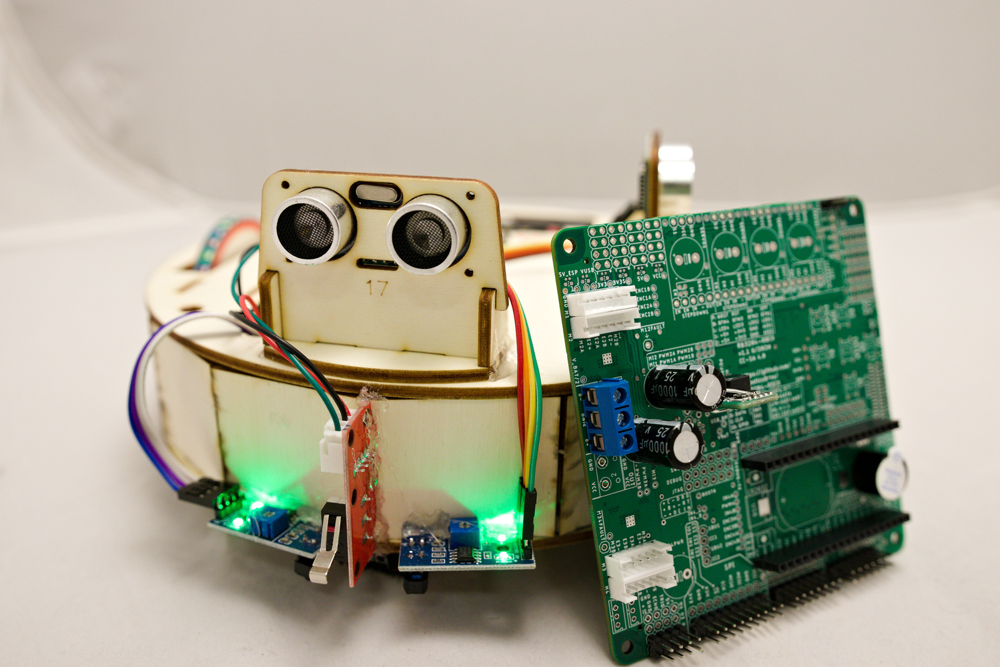
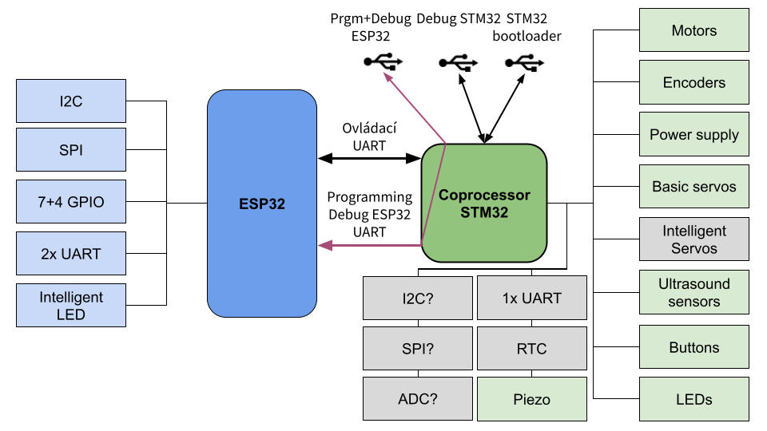

# Software development
Both microcontrollers are programmed using [PlatformIO](https://platformio.org/) in [VSCode](https://code.visualstudio.com/) using C++ language.

## STM32
The software for STM32 is located in `fw` directory.
STM32 uses our [bootloader](https://github.com/RoboticsBrno/sboot_stm32), which is based on [sboot_stm32](https://github.com/dmitrystu/sboot_stm32).

The Czech manuals are in these presentations:
- [RBCX](https://docs.google.com/presentation/d/1NP2yii9ZfLh_otC2qz9LTG4m3adRt0aGy-u8AYXcY6M/)
- [RBCX firmware](https://docs.google.com/presentation/d/1B4t7tvKhTz8Nwm9SQEp_2enkG-x4il2hApb1tdSRLiI)

### Bootloader installation
RBCX might work without bootloader, but it is not recommended. Thanls to the bootloader, you can program STM32 without STLink programmer and program ESP32 directly trough USB-C in RBCX.

- you need STLink programmer
  - connect STLink programmer to the board→
    - C → SWCLK
    - -→ GND
    - D → SWDIO
    - R → RST
    - +→ 3.3V (optional, if you want to power the board from STLink)
  - !! If STLink is not connected to the computer, STM32 is in a reset state !!
  - 

- clone `https://github.com/RoboticsBrno/sboot_stm32`
- `apt-get install stlink-tools make gcc-arm-none-eabi git`
- flash prebuilt bootloader `st-flash --reset --format ihex write prebuilt/rbcx_v11/firmware.hex`
- compile and flash firmware `make prerequisites && ./rbcx_build_v11.sh && make program`

### Firmware installation
Firmware for STM32 is located in `fw/rbcx-coprocessor` directory.
RBCX might be programmed using STLink programmer or using USB-C connector.

### STLink development
In VSCode - PlatformIO, you have to change the environment to `hw*_stlink`.
This setup supports debugging. Just press `F5` or `Debug` button in VSCode.

### USB C development
If you want to use USB-C connector for programming STM32, you need to press `DOWN` button (B2) on the board during the boot.
In default mode, USB-C connector is used for communication with ESP32.

To enable Debug output from STM32, you have to press `LEFT` button (B3) on the board during the boot. This will add virtual debug serial port to the USB-C connector.

STM32 will create two virtual COM ports (one for STM32 and one for ESP32).
In VSCode - PlatformIO, you have to change the environment to `hw*_sboot`.
This setup does not support debugging (use STLink programmer for debugging).

## ESP32
The library for ESP32 is in [RB3204-RBCX-library](https://github.com/RoboticsBrno/RB3204-RBCX-library) repository.
Examples for the [Robotka](https://robotka.robotickytabor.cz), which is a robot based on RBCX, are in [robotka-examples](https://github.com/RoboticsBrno/robotka-examples) repository.

## Programming ESP32
STM32 behaves like "FTDI" on dev kit, so you can program ESP32 using USB-C connector.

- Controls boot pins on ESP32 according to RTS/DTR.
- It supports faster UART than ESP32 DevKit (faster programming)
- ESP32 DevKit cannot be programmed via its own USB while plugged into RBCX

## ESP32 and STM32 communication
ESP32 and STM32 communicate via UART (baud 921600)

Microcontrollers are communicating using [Protocol Buffers](https://developers.google.com/protocol-buffers) (Protobuf).
Protobuf messages are defined in [RB3204-RBCX-coproc-comm](https://github.com/RoboticsBrno/RB3204-RBCX-coproc-comm) repository.

### Commands
"Run motor at 50%", "Battery voltage is 6802mV", "Reset the board"

Protocol: [Protobuf](https://protobuf.dev/) + [COBS](https://en.wikipedia.org/wiki/Consistent_Overhead_Byte_Stuffing) + small header

- `0x00, <length>, <data>`

Keepalive - when ESP32 does not respond, it is reset, STM32 turns off peripherals

### Installation and usage
- clone `https://github.com/RoboticsBrno/RB3204-RBCX-coproc-comm`
- install protobuf compiler `apt-get install protobuf-compiler`
- install nanopb generator `pip3 install nanopb==0.4.4`
- edit `rbcx.proto` file
- compile protobuf messages using `./generate.sh`
- commit and push changes to GitHub
- change GIT hash in FW and RBCX library to the latest commit hash

## Schematic
