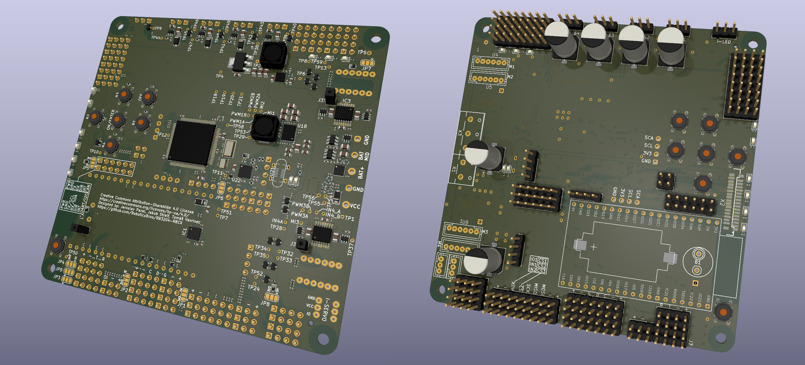
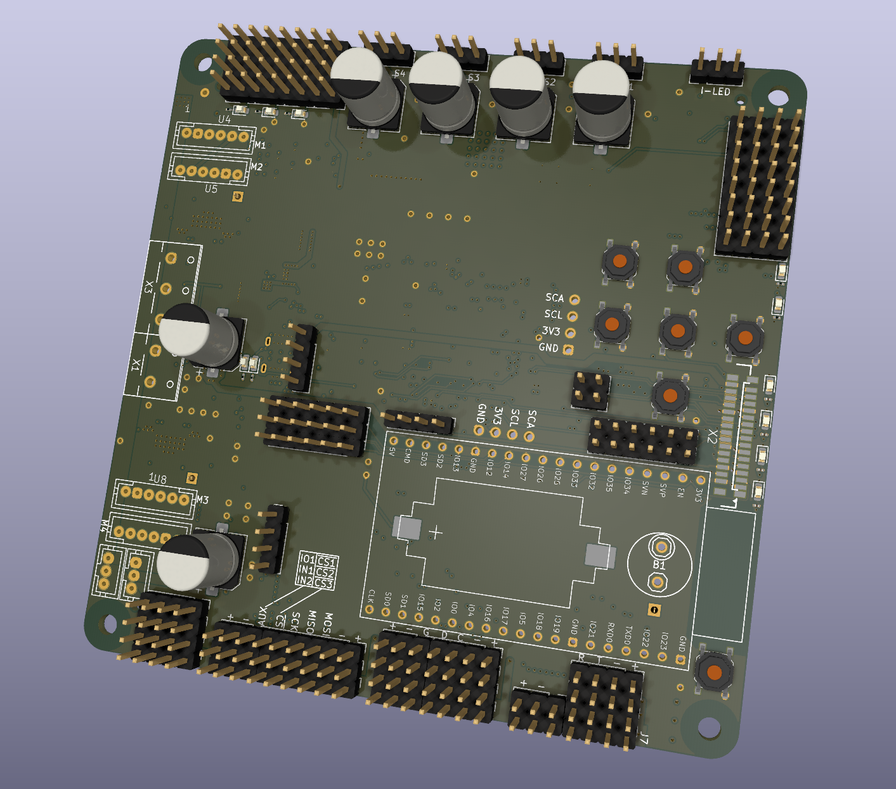

# RB3204-RBCX V1.3

## changes compared to V1.2:
- Translated old project to KiCad 
- Added built-in battery charger with simple balancer 
- Added of built-in 5V stepdown
- Removal of built-in micro USB

     

